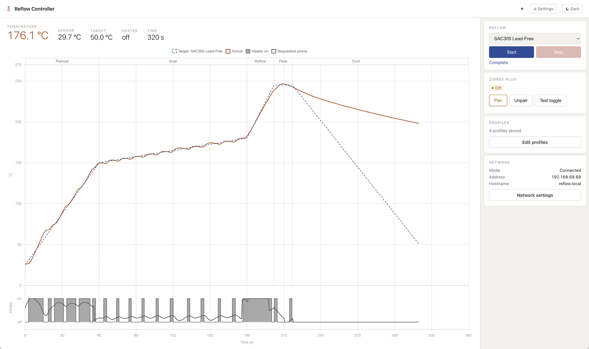

# Reflow Hotplate Controller

[](https://github.com/bechhansen/reflow/actions/workflows/esp32-build.yml)
[](LICENSE)
[](https://github.com/espressif/esp-idf)
[](https://www.espressif.com/en/products/socs/esp32-c6)

Reflow-solder surface-mount boards on an old clothes iron, turned upside down,
switched by an off-the-shelf Zigbee smart plug and controlled from your
browser. An ESP32-C6 reads the soleplate with an IR sensor and follows a
reflow profile.



*A complete run of the built-in SAC305 Lead-Free profile in the web interface:*
- *The measured temperature (solid) follows the profile (dashed) through preheat, soak and the 245 °C peak.*
- *The heater strip shows the separate 2 s pulses on the soak, and full power on the ramp to the peak.*
- *Cool-down is passive.*

## The problem

Surface-mount parts are soldered by *reflow*. You apply solder paste, place
the parts, and heat the board along a profile: a preheat ramp, a soak where
the flux activates and the board evens out, a short peak above the solder's
melting point, then a cool-down. Too cold and the joints don't wet. Too hot,
or too long at the peak, and parts and flux suffer.

Hobbyists usually have two options:
- **Buy** a reflow oven or hotplate.
- **Build** one from a toaster oven or hotplate, with a thermocouple, a solid-state
  relay and mains wiring.

The DIY route means working on 230 V mains yourself, and the cheap commercial
ones often follow the profile poorly.

This project avoids both:
- **Heat source: an ordinary clothes iron.** It sits soleplate-up in a 3D-printed stand, and its
  soleplate is a flat, fairly even hotplate.
- **Switching: a commercial Zigbee smart plug.** You never touch mains wiring; the plug is a certified
  product that just turns the iron on and off.
- **Sensing: a contactless MLX90614 IR sensor** above the soleplate. There's no thermocouple
  to attach.
- **Control: an ESP32-C6.** It has Wi-Fi and Zigbee on one chip, and runs the
  control loop and a web UI.

That setup is cheap and safe to build, but hard to control well:
- **A slow relay:** a smart plug is an on/off relay that must not be toggled rapidly (minimum
  2 s between switches here), and every command goes over the radio.
- **An unreliable link:** Wi-Fi and Zigbee share one radio on the ESP32-C6, so plug replies
  get lost. The firmware confirms every switch by reading the plug back, retries,
  and cross-checks against the measured temperature.
- **Delay and a thermostat:** the iron heats through a lag and has its own thermostat.
- **No active cooling:** cool-down is whatever the iron does by itself.

The controller handles all of that. With a pulse limit of 2 s it follows a
profile's preheat, soak and reflow phases to about 1–2 °C RMS on the real iron.

## Features

- **Profile following:**
  - model feedforward plus PI correction, following the profile in real time
  - pulse timing centred on the target on slow stretches
  - a coast guard that stops the stored heat overshooting the peak
- **Safe plug control:**
  - every switch confirmed by read-back, with no overlapping commands and a 2 s
    minimum dwell
  - the wanted state re-sent after each change, and the heater forced off if the
    iron still heats while it should be off
  - forced off at boot
- **Web UI:**
  - a live chart of profile and temperature, with phase names and a heater strip
    showing when the plug was on and how much power was requested
  - Start and Stop, a profile editor, Wi-Fi setup
  - dark mode, and °C or °F
  - designed to work without colour cues
- **Faults:** the heater is switched off at once on sensor loss, over-temperature
  (relative to the profile's peak), plug loss, or a stalled heat source.
- **Firmware updates over Wi-Fi** from GitHub production releases (`vX.Y.Z`),
  with automatic rollback if a new firmware doesn't start properly. Manual
  upload works for development and beta builds.
- **Hardware-in-the-loop tooling** (`controller/tools/hil.py`): record runs over USB,
  fit a new heat source's thermal model from a step test, and analyze tracking
  and switching.

## Hardware

| Part | Notes |
|---|---|
| ESP32-C6 dev board, **8 MB flash** | Needs Wi-Fi and 802.15.4 (Zigbee) on one chip. 8 MB gives two firmware slots for over-the-air updates. |
| MLX90614ESF IR sensor module | I²C at address 0x5A, 3.3 V. Modules usually have the 4.7 kΩ pull-ups; a bare sensor needs them added. |
| Zigbee smart plug | Any plug with a standard On/Off cluster. Rated for the iron's power. |
| Clothes iron | Dial at maximum; the controller switches its power. |
| 3D-printed parts | An iron stand, a sensor bracket and an enclosure (see `hardware/`). |

Wiring (defaults, changeable in `idf.py menuconfig`): SDA to GPIO 6, SCL to GPIO 7, and 3V3 and GND.
Details and cable recommendations are in [REQUIREMENTS.md](REQUIREMENTS.md) (REQ-HW).

## Getting started

1. **Build and flash** once over USB. See [BUILDING.md](BUILDING.md). In short:
   `idf.py set-target esp32c6 && idf.py build && idf.py flash`
2. **Wi-Fi:** on first boot the controller opens the access point `Reflow-Setup`.
   Connect to it, open http://192.168.4.1, choose your network and save.
3. **Pair the plug:** open `http://reflow.local` (or the controller's IP). Click **Pair**,
   then put the plug into pairing mode.
4. **Run:** place the board on the soleplate, pick a profile and press **Start**.
   Watch the chart. **Stop** switches the heater off at once.

After that, updates come over Wi-Fi: **Settings → Firmware → Install**.

### Another heat source

The controller ships tuned for the iron it was developed on. For a different
iron or hotplate, run a step test and fit its model. That takes about 5
minutes, as described in [BUILDING.md](BUILDING.md#tuning-for-your-heat-source).

## Measured performance

These were measured on the development setup: an old clothes iron and a Zigbee plug
with 2 s minimum switching.

| Profile, phase | Tracking (RMS) |
|---|---|
| SMD291SNL SAC305, preheat / soak / reflow | 1.6 / 1.1 / 1.8 °C |
| SAC305 Lead-Free, peak | 244.8 °C vs 245 °C target |
| Sn63Pb37, soak | 1.4 °C (±2.5 °C, the floor for 2 s pulses) |

**Limits set by the iron itself:**
- **Ramps:** about 2.4 °C/s at 200 °C, so steep reflow ramps lag 5–10 °C.
- **Thermostat:** it can cut out near 230 °C when approached fast.
- **Cool-down:** passive, so time above liquidus runs about twice the profile's.

## Safety

This project switches a mains-powered heating appliance, and the plate gets
hot enough to burn skin and ignite materials.
- **Never leave a run unattended.** Keep flammable material away from the plate.
- **Keep the iron's own thermostat and thermal fuse in place.** Don't bypass them.
- **Use a plug rated for the iron's power.** Unplug the iron when you're done.
- **The software is provided without warranty** (see [LICENSE](LICENSE)). You use it
  at your own risk.

## Repository layout

```
controller/          ESP-IDF firmware (ESP32-C6)
  main/              C sources: control law, plug service, Zigbee, web server, OTA
  web/               Web UI (embedded in the firmware at build time)
  profiles/          Default reflow profiles (JSON)
  test/              Host unit tests (control law, plug state machine)
  tools/             hil.py (hardware-in-the-loop), embed_web.py (build step)
hardware/            3D-printed stand, sensor bracket, enclosure
BUILDING.md          Build, flash, first boot, updates, releasing, tuning
REQUIREMENTS.md      Requirements (REQ-HW/FW/NET/WEB)
CLAUDE.md            Architecture and developer notes
```

## Contributing

Issues and pull requests are welcome. Please run the host tests before
submitting:
```bash
make -C controller/test/reflow_algo test
make -C controller/test/plug_fsm test
```
For changes to control or plug timing, include a recorded run
(`controller/tools/hil.py`) where you can.

## License

Copyright © 2026 Peer Bech Hansen.

This project is licensed under the **GNU General Public License v3.0**. See
[LICENSE](LICENSE).

You may use, study, modify and share it. If you distribute it, or a modified
version, you must do so under the same license and make the full source
available. It's provided without any warranty.

The firmware has to link Espressif's binary-only libraries: the Wi-Fi/radio
drivers and the Zigbee stack. [LICENSE-EXCEPTION.md](LICENSE-EXCEPTION.md)
grants the additional permission (GPL v3 section 7) needed to distribute the
firmware with them.

Third-party components and their licenses are listed in
[THIRD-PARTY-NOTICES.md](THIRD-PARTY-NOTICES.md). They include Chart.js (MIT),
ESP-IDF (Apache 2.0), the Espressif Zigbee SDK and ZBOSS, cJSON (MIT) and mdns
(Apache 2.0).
